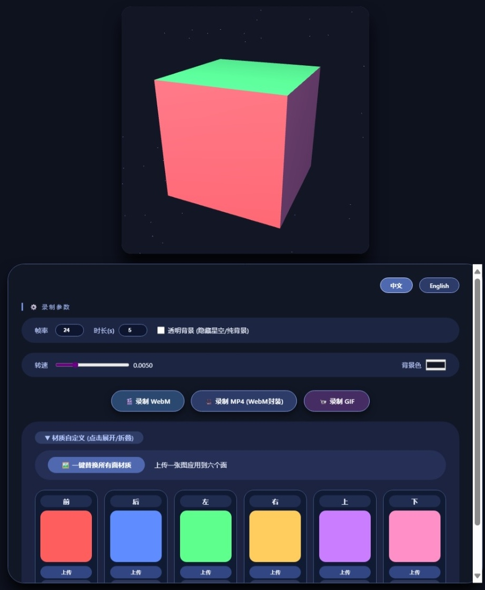

# 3D 旋转立方体
---
[English](/README.md) | [中文](/README_zh-CN.md)

[](https://notmicrover.github.io/3D-rotation)
[](https://opensource.org/licenses/MIT)

一个基于 Three.js 的交互式 3D 立方体，支持实时旋转、单独贴图替换、透明背景和视频/GIF 录制。

 <!-- 请将截图文件命名为 screenshot-zh.png 并放入仓库 -->

## 功能特点
---
- **实时旋转** – 通过滑块调整旋转速度。
- **材质自定义** – 单独替换每个面的贴图，或一键替换所有六个面。
- **透明背景** – 开关星空背景，方便后期合成。
- **实时背景色** – 使用颜色选择器即时更改背景。
- **录制功能** – 将动画导出为 WebM、MP4（WebM 封装）或 GIF。
- **多语言界面** – 根据访客 IP 自动在中英文间切换（检测中国 IP），并提供手动切换按钮。

## 使用方法
---
1. 在任意现代浏览器中打开[在线演示](https://notmicrover.github.io/3D-rotation)。
2. 使用控制面板调整参数：
   - **帧率 & 时长** – 设置录制质量。
   - **透明背景** – 隐藏星星以获得干净的透明背景。
   - **转速** – 控制立方体旋转速度。
   - **背景色** – 任意选择纯色背景。
3. **材质** – 点击材质区域展开，然后：
   - 为每个面单独上传图片，或使用“一键替换所有面材质”。
   - 点击“恢复”还原为初始颜色。
4. **录制** – 选择 WebM、MP4 或 GIF。录制将在设定的时长后自动开始并下载。

## 技术栈
---
- [Three.js](https://threejs.org/) – 3D 渲染。
- [MediaRecorder API](https://developer.mozilla.org/en-US/docs/Web/API/MediaRecorder) – WebM/MP4 录制。
- [gif.js](https://github.com/jnordberg/gif.js) – 浏览器内 GIF 编码。
- [ipapi.co](https://ipapi.co/) – IP 地理位置服务，用于自动语言切换。
- 纯 HTML/CSS/JavaScript – 无需构建工具。

## 本地开发
---
直接克隆仓库，然后在浏览器中打开 `index.html` 即可。

```bash
git clone https://github.com/notmicrover/3D-rotation.git
cd 3D-rotation
# 然后用你喜欢的浏览器打开 index.html
```

无需服务器或构建步骤。

## 许可证

---

本项目采用 MIT 许可证 – 详见 LICENSE 文件。
