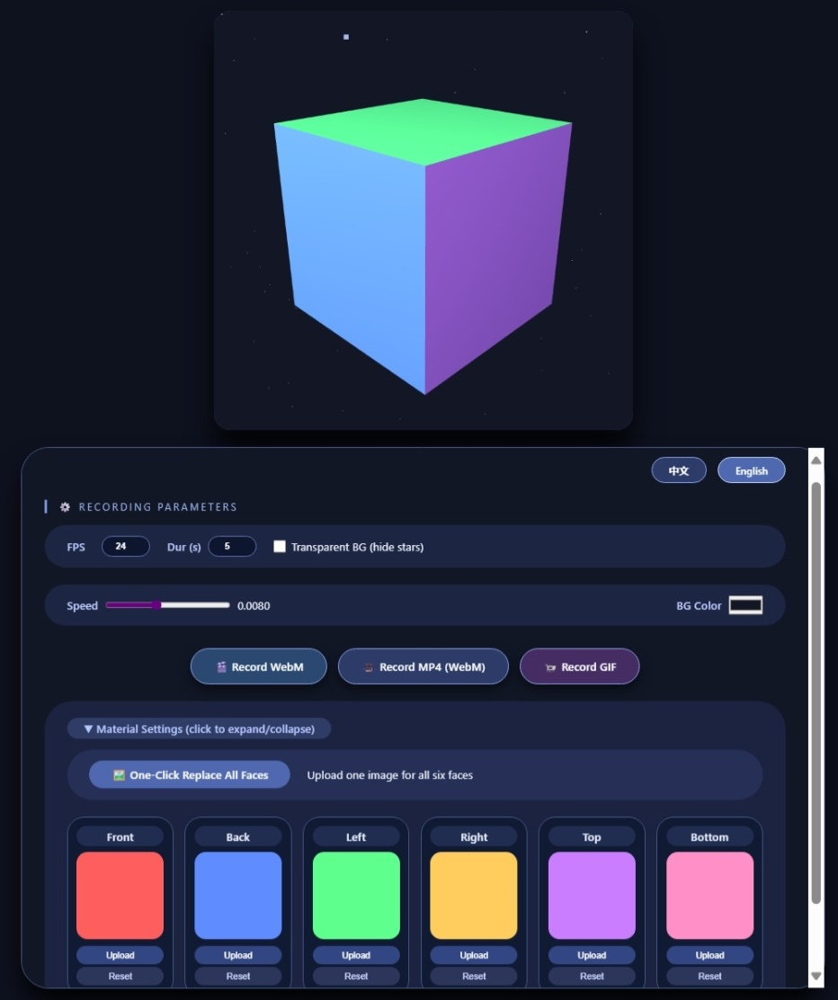

# 3D Rotation Cube
---
[English](/README.md) | [中文](/README_zh-CN.md)
[](https://notmicrover.github.io/3D-rotation)
[](https://opensource.org/licenses/MIT)

An interactive 3D cube built with Three.js that supports real-time rotation, per-face texture replacement, transparent background, and video/GIF recording.

 <!-- You can add a screenshot later -->

## Features
---
- **Real‑time Rotation** – Adjust rotation speed with a slider.
- **Material Customization** – Replace textures on individual faces or all six faces with one click.
- **Transparent Background** – Toggle star field on/off, perfect for compositing.
- **Live Color Picker** – Change background color instantly.
- **Recording** – Export animations as WebM, MP4 (WebM container), or GIF.
- **Multi‑language UI** – Automatically switches between Chinese and English based on visitor IP (detects mainland China) with manual toggle buttons.

## How to Use
---
1. Open the [live demo](https://notmicrover.github.io/3D-rotation) in any modern browser.
2. Use the control panel to adjust parameters:
   - **FPS & Duration** – Set recording quality.
   - **Transparent BG** – Hide stars for a clean alpha background.
   - **Speed** – Control rotation speed.
   - **BG Color** – Pick any solid color.
3. **Material** – Click the material section to expand, then:
   - Upload an image for each face individually, or use "One‑Click Replace All Faces".
   - Click "Reset" to revert to the original color.
4. **Record** – Choose WebM, MP4, or GIF. The recording will start after the set duration and automatically download.

## Technical Stack
---
- [Three.js](https://threejs.org/) – 3D rendering.
- [MediaRecorder API](https://developer.mozilla.org/en-US/docs/Web/API/MediaRecorder) – WebM/MP4 recording.
- [gif.js](https://github.com/jnordberg/gif.js) – GIF encoding in the browser.
- [ipapi.co](https://ipapi.co/) – IP geolocation for language auto‑switch.
- Plain HTML/CSS/JavaScript – No build tools required.

## Local Development
---
Simply clone the repository and open `index.html` in your browser.

```bash
git clone https://github.com/notmicrover/3D-rotation.git
cd 3D-rotation
# Then open index.html with your favorite browser
```

No server or build step is needed.

## License
---
This project is licensed under the MIT License – see the LICENSE file for details.
